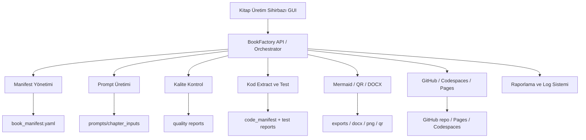
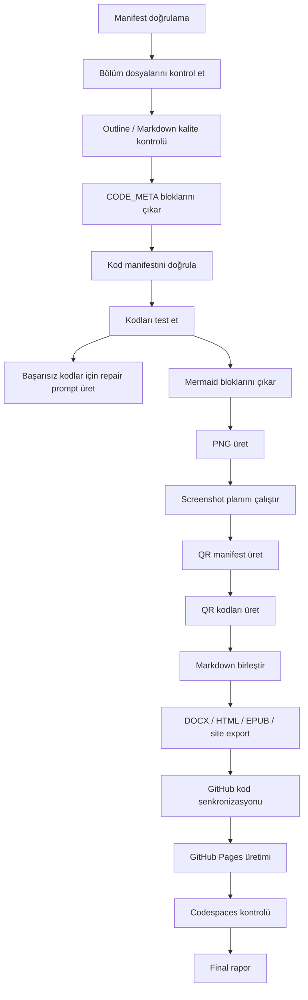

Özetle: Mevcut BookFactory yapısı için en doğru çözüm, **manifest tabanlı çalışan, adım adım ilerleyen bir “Kitap Üretim Sihirbazı”** geliştirmek olur. Arayüz yalnızca form dolduran bir ekran olmamalı; kitabın fikrinden başlayıp LLM prompt üretimi, bölüm metinlerinin alınması, kalite kontrol, kod testi, Mermaid/QR/DOCX üretimi, GitHub senkronizasyonu, Codespaces ve GitHub Pages doğrulamasına kadar tüm hattı izleyen bir **üretim kontrol paneli** olmalı.

İncelediğim `book_manifest.yaml` dosyası şu ana blokları içeriyor: `book`, `language`, `cumulative_app`, `scope`, `structure`, `approval_gates`, `code`, `assets`. Bu yapı GUI için çok uygun. Arayüzün görevi bu manifesti üretmek, doğrulamak, güncellemek ve her üretim adımını manifestle ilişkilendirmek olmalı.

---

## 1. Önerilen genel yaklaşım

Bu sistemi üç katmanlı düşünmek en sağlıklı yapı olur:



Benim önerim şu mimari olur:

| Katman                   | Öneri                                                                  | Gerekçe                                                              |
| ------------------------ | ---------------------------------------------------------------------- | -------------------------------------------------------------------- |
| Arayüz                   | React tabanlı web arayüzü veya Tauri/Electron paketli masaüstü arayüzü | Gelişmiş, modern, sihirbaz mantığına uygun                           |
| Backend                  | FastAPI                                                                | Mevcut Python araçlarıyla doğal entegrasyon sağlar                   |
| Görev çalıştırıcı        | Python subprocess + job queue                                          | Mevcut CLI ve scriptlerin kontrollü çalıştırılması için              |
| Veri saklama             | SQLite başlangıçta yeterli                                             | Proje, işlem geçmişi, log, durum takibi için                         |
| Gerçek zamanlı izleme    | WebSocket veya Server-Sent Events                                      | Kod testi, DOCX üretimi, GitHub push gibi işlemler canlı izlenebilir |
| Mevcut araç entegrasyonu | `bookfactory` CLI komutları                                            | Mevcut sistem bozulmadan GUI üzerinden çağrılır                      |

Mevcut Streamlit dashboard okunur durum paneli olarak kalabilir; fakat sizin tarif ettiğiniz sistem için daha gelişmiş bir **yazılabilir, yönlendirici ve işlem başlatabilen GUI** gerekir.

---

## 2. Sihirbaz ekranları nasıl olmalı?

### Aşama 1 — Yeni kitap başlatma

Bu aşamada kullanıcıdan kitabın temel kimliği alınmalı.

Toplanacak alanlar:

| Arayüz alanı   | Manifest karşılığı                                                     |
| -------------- | ---------------------------------------------------------------------- |
| Kitap adı      | `book.title`                                                           |
| Alt başlık     | `book.subtitle`                                                        |
| Yazar          | `book.author`                                                          |
| Baskı          | `book.edition`                                                         |
| Yıl            | `book.year`                                                            |
| Ana dil        | `language.primary_language`                                            |
| Çıktı dilleri  | `language.output_languages`                                            |
| Kitabın konusu | Ek alan olarak `book.description` veya `pedagogy.subject`              |
| Hedef kitle    | Ek alan olarak `pedagogy.audience`                                     |
| Ön koşullar    | Ek alan olarak `pedagogy.prerequisites`                                |
| Bölüm sayısı   | `structure.chapters` üretimi için                                      |
| Kitap türü     | Ders kitabı, uygulamalı rehber, akademik kitap, laboratuvar kitabı vb. |

Bu aşamanın sonunda henüz kesin manifest üretilmez; önce LLM’den kitap kurgusu önerisi alınır.

---

## 3. LLM’den kitap yapısı önerisi alma aşaması

Bu ekran çok önemli. Kullanıcı temel bilgileri girdikten sonra sistem otomatik olarak bir “kitap mimarisi üretim promptu” hazırlamalı.

### GUI’de bu ekranda bulunması gerekenler

| Bileşen                     | İşlev                                                |
| --------------------------- | ---------------------------------------------------- |
| Kitap özeti formu           | Kullanıcının verdiği temel bilgileri gösterir        |
| LLM modeli seçimi           | Manuel kopyala-yapıştır veya API modu                |
| Prompt önizleme             | Oluşturulan prompt görüntülenir                      |
| Promptu kopyala / indir     | `.md` olarak dışa aktarılır                          |
| LLM cevabı yapıştır / yükle | YAML/JSON/Markdown çıktı alınır                      |
| Yapı önerisini doğrula      | Bölüm sayısı, kapsam, başlıklar kontrol edilir       |
| Manifest’e dönüştür         | Onaylanan yapı `book_manifest.yaml` haline getirilir |

Bu aşamada üretilecek prompt şu şekilde olabilir:

````markdown
# Kitap Yapısı ve Manifest Tasarımı Üretim Promptu

Sen kıdemli bir bilgisayar mühendisliği akademisyeni, teknik kitap editörü ve öğretim tasarım uzmanısın.

Aşağıdaki bilgilerden hareketle uygulamalı, bölüm bölüm ilerleyen, tutarlı ve üretime hazır bir teknik kitap kurgusu tasarla.

## 1. Temel kitap bilgileri

- Kitap adı: {{book.title}}
- Alt başlık: {{book.subtitle}}
- Yazar: {{book.author}}
- Yıl: {{book.year}}
- Ana dil: {{language.primary_language}}
- Hedef çıktı dilleri: {{language.output_languages}}
- Kitap konusu: {{book_subject}}
- Hedef kitle: {{target_audience}}
- Ön koşullar: {{prerequisites}}
- Tahmini bölüm sayısı: {{chapter_count}}
- Öğretim yaklaşımı: kavram → örnek → uygulama → mini proje → kontrol listesi
- Kitabın genel uygulama projesi: {{cumulative_app.name}}
- Uygulama açıklaması: {{cumulative_app.description}}

## 2. Teknoloji kapsamı

Kitapta yer alması istenen teknolojiler:

{{scope.stack}}

Kitap kapsamı dışında tutulacak konular:

{{scope.out_of_scope}}

## 3. Üretilecek çıktı

Aşağıdaki YAML şemasına uygun, doğrudan `book_manifest.yaml` dosyasına dönüştürülebilecek bir çıktı üret.

Tam metin yazma. Yalnızca kitap yapısı, bölüm planı, kapsam ve üretim metaverisi üret.

## 4. Beklenen YAML alanları

```yaml
book:
  title:
  subtitle:
  author:
  edition:
  year:
  framework_version:
  description:
  target_audience:
  prerequisites:
  learning_goals:

language:
  primary_language:
  output_languages:
  file_naming_language:
  manifest_language:
  automation_language:

cumulative_app:
  name:
  description:
  pedagogical_role:
  final_capabilities:

scope:
  stack:
  out_of_scope:
  assumptions:
  constraints:

structure:
  chapters:
    - id:
      title:
      file:
      status:
      summary:
      learning_outcomes:
      key_concepts:
      cumulative_app_increment:
      expected_code_outputs:
      expected_visual_outputs:
      screenshot_plan:
        - id:
          title:
          route:
          caption:

approval_gates:
  manifest_validation:
  chapter_input_generation:
  outline_review:
  full_text_generation:
  code_validation:
  markdown_quality_check:
  post_production_build:

code:
  extract:
  test:
  github_sync:
  qr_generation:
  supported_languages:
  test_strategy:

assets:
  screenshot_automation:
  mermaid_generation:
  manual_override:
  asset_policy:
````

## 5. Kalite kuralları

* Bölüm başlıkları pedagojik olarak basitten karmaşığa ilerlemeli.
* Her bölüm önceki bölümler üzerine inşa edilmeli.
* Kitap genelinde tek bir kümülatif uygulama gelişmeli.
* Kapsam dışı konular bölüm planına sızmamalı.
* Her bölüm için en az bir somut uygulama çıktısı tanımlanmalı.
* Görsel ağırlıklı bölümlerde ekran görüntüsü planı olmalı.
* Kod üretilecek bölümlerde test edilebilir çıktı beklentisi belirtilmeli.
* Dosya adları küçük harfli, İngilizce ve güvenli olmalı.
* Çıktı yalnızca YAML olmalı.

````

Bu prompt ile elde edilen çıktı, doğrudan GUI tarafından ayrıştırılabilir ve manifest editörüne aktarılabilir.

---

## 4. Manifest editörü

LLM’den gelen kitap yapısı doğrudan kaydedilmemeli. Önce bir **Manifest Review** ekranında kullanıcıya gösterilmeli.

Bu ekranda şu paneller olmalı:

| Panel              | İçerik                                         |
| ------------------ | ---------------------------------------------- |
| Kitap bilgileri    | Başlık, yazar, yıl, dil                        |
| Bölüm listesi      | Bölüm ID, başlık, dosya adı, durum             |
| Teknoloji kapsamı  | Dahil / hariç teknolojiler                     |
| Uygulama kurgusu   | Kümülatif uygulama adı ve bölüm bazlı gelişimi |
| Kalite kapıları    | Hangi kontroller zorunlu?                      |
| Otomasyon ayarları | Kod testi, Mermaid, QR, screenshot, GitHub     |
| YAML önizleme      | Gerçek `book_manifest.yaml` çıktısı            |

Bu ekranın sonunda “Manifesti Onayla ve Proje Klasörünü Oluştur” düğmesi olmalı.

---

## 5. Proje klasör yapısı

GUI her kitap için standart klasör yapısını otomatik oluşturmalı:

```text
workspace/
  react/
    book_manifest.yaml
    prompts/
      chapter_inputs/
        chapter_01_input.md
        chapter_02_input.md
    chapters/
      chapter_01_modern_web_giris.md
      chapter_02_javascript_temelleri.md
    chapter_backups/
    assets/
      images/
      screenshots/
      mermaid/
      qr/
    build/
      code/
      test_reports/
      quality_reports/
      code_manifest.json
      code_manifest.yaml
      qr_manifest.yaml
      github_sync_report.json
      codespaces_check_report.json
    exports/
      docx/
      html/
      epub/
      site/
    configs/
      post_production_profile_react.yaml
````

Bu yapı hem mevcut BookFactory yaklaşımıyla uyumlu olur hem de GUI üzerinden dosyaların yönetilmesini kolaylaştırır.

---

## 6. Bölüm input prompt üretim ekranı

Manifest onaylandıktan sonra her bölüm için ayrı input promptları hazırlanmalı.

Ekran yapısı şöyle olabilir:

| Alan                       | Açıklama                                                      |
| -------------------------- | ------------------------------------------------------------- |
| Bölüm seçici               | Bölüm 1, Bölüm 2, …                                           |
| Bölüm özeti                | Manifestten gelen bölüm açıklaması                            |
| Öğrenme çıktıları          | Bölüm bazlı hedefler                                          |
| Kümülatif uygulama katkısı | Bu bölümde uygulamaya ne eklenecek?                           |
| Kod beklentileri           | Hangi kod blokları üretilecek?                                |
| Görsel beklentiler         | Mermaid, screenshot, tablo, şekil                             |
| Prompt önizleme            | LLM’e verilecek tam input                                     |
| Kopyala / Markdown indir   | LLM’e yükleme için                                            |
| Durum                      | not_started, prompt_ready, sent_to_llm, md_imported, reviewed |

Bu aşamada sistem, mevcut `tools/generate_chapter_inputs.py` benzeri yapıyı GUI üzerinden çağırabilir.

---

## 7. LLM tam metin yükleme ekranı

Burada iki çalışma modu olmalı:

### Manuel LLM modu

Kullanıcı promptu ChatGPT, Gemini, Claude vb. bir modele yükler. Modelden gelen tam metin `.md` olarak indirilir veya kopyalanır. GUI’de ilgili bölüme yüklenir.

### API modu

API anahtarları tanımlanmışsa GUI doğrudan LLM’e istek gönderir ve sonucu ilgili bölüm dosyasına kaydeder.

Başlangıç için manuel mod daha güvenli olur. Çünkü uzun bölüm metinlerinde kullanıcı kontrolü önemlidir.

Her bölüm satırı için şu durumlar izlenebilir:

| Durum              | Anlamı                      |
| ------------------ | --------------------------- |
| `planned`          | Bölüm manifestte var        |
| `prompt_ready`     | Girdi promptu üretildi      |
| `sent_to_llm`      | LLM’e gönderildi            |
| `md_imported`      | Tam metin Markdown yüklendi |
| `outline_checked`  | Outline kontrolü geçti      |
| `code_extracted`   | Kod blokları çıkarıldı      |
| `code_tested`      | Kod test edildi             |
| `assets_ready`     | Mermaid/QR/screenshot hazır |
| `production_ready` | Bölüm üretime hazır         |
| `done`             | Bölüm tamamlandı            |

---

## 8. Production pipeline ekranı

Bu ekran sistemin kalbi olmalı. Her işlem adımı ayrı bir job olarak çalışmalı.

Önerilen işlem sırası:



Her adım için GUI’de şu bilgiler görünmeli:

| Bilgi             | Örnek                                       |
| ----------------- | ------------------------------------------- |
| İşlem adı         | Kod testleri                                |
| Komut             | `python -m bookfactory test-code ...`       |
| Başlangıç zamanı  | 2026-05-01 20:15                            |
| Bitiş zamanı      | 2026-05-01 20:17                            |
| Durum             | Başarılı / Hatalı / Atlandı                 |
| Üretilen dosyalar | `code_test_report.md`, `code_manifest.json` |
| Log               | stdout / stderr                             |
| Hata varsa        | LLM repair prompt bağlantısı                |

---

## 9. Raporlama paneli

Raporlama yalnızca “başarılı/başarısız” göstermemeli. Ayrıntılı denetim ekranı olmalı.

### Görüntülenmesi gereken raporlar

| Rapor                     | İçerik                                                 |
| ------------------------- | ------------------------------------------------------ |
| Manifest doğrulama raporu | Eksik alan, yanlış tip, bölüm dosya adı hatası         |
| Outline kalite raporu     | Başlık yapısı, zorunlu bölümler, bölüm bütünlüğü       |
| Markdown kalite raporu    | CODE_META, tablo, görsel, bağlantı, başlık hiyerarşisi |
| Kod çıkarma raporu        | Kaç kod bloğu bulundu, hangi dosyalara yazıldı         |
| Kod test raporu           | Passed, failed, skipped, hata mesajları                |
| Mermaid raporu            | Kaç diyagram bulundu, kaç PNG üretildi                 |
| QR raporu                 | Kod sayfası QR, kaynak kod QR, hatalı URL var mı       |
| DOCX üretim raporu        | Gömülü görseller, tablolar, bağlantılar                |
| GitHub sync raporu        | Push edilen dosyalar, branch, commit                   |
| Codespaces raporu         | `.devcontainer` var mı, portlar doğru mu               |
| GitHub Pages raporu       | Site üretildi mi, linkler çalışıyor mu                 |

Ana dashboard’da şu özet metrikler olmalı:

```text
Kitap üretim durumu: %72
Bölümler: 5 / 16 tamamlandı
Kod blokları: 38 bulundu
Kod testleri: 34 başarılı, 2 hatalı, 2 atlandı
Mermaid diyagramları: 12 / 12 üretildi
QR kodları: 38 / 38 üretildi
DOCX durumu: üretime hazır
GitHub durumu: senkronizasyon bekliyor
```

---

## 10. GitHub, Codespaces ve Pages ekranı

Bu ekran ayrı bir modül olmalı.

Toplanacak alanlar:

| Alan                 | Açıklama                              |
| -------------------- | ------------------------------------- |
| GitHub owner         | Örn. `bmdersleri`                     |
| Repo adı             | Örn. `react-web`                      |
| Branch               | `main`                                |
| Kod klasörü          | `kodlar/` veya `docs/kodlar/`         |
| Pages klasörü        | `docs/` veya `gh-pages`               |
| Codespaces aktif mi? | Evet/Hayır                            |
| Devcontainer üret    | `.devcontainer` dosyalarını oluşturur |
| Pages test et        | HTML ve link kontrolü yapar           |

Manifest’e şu blok eklenebilir:

```yaml
github:
  enabled: true
  owner: "bmdersleri"
  repo: "react-web"
  branch: "main"
  code_root: "kodlar"
  pages:
    enabled: true
    source: "docs"
    url: ""
  codespaces:
    enabled: true
    devcontainer: true
    check_required: true
```

---

## 11. Manifest dosyasına eklenmesini önerdiğim alanlar

Mevcut manifest iyi bir çekirdek sunuyor. Ancak GUI tabanlı üretim hattı için şu alanlar faydalı olur:

```yaml
project:
  id: "react_web_programlama"
  workspace: "workspace/react"
  created_at: "2026-05-01"
  updated_at: "2026-05-01"
  status: "in_progress"

pedagogy:
  audience:
    - "React öğrenmeye başlayan lisans öğrencileri"
    - "Temel JavaScript bilen geliştiriciler"
  prerequisites:
    - "Temel HTML"
    - "Temel CSS"
    - "Temel JavaScript"
  teaching_pattern:
    - "Kavram"
    - "Örnek"
    - "Uygulama"
    - "Mini görev"
    - "Kontrol listesi"

llm:
  mode: "manual"
  preferred_models:
    - "ChatGPT"
    - "Gemini"
    - "Claude"
  prompt_output_dir: "prompts/chapter_inputs"
  full_text_input_dir: "chapters"

production:
  profile: "configs/post_production_profile_react.yaml"
  stop_on_error: true
  backup_before_run: true
  generate_reports: true

github:
  enabled: false
  owner: ""
  repo: ""
  branch: "main"
  pages:
    enabled: false
    source: "docs"
  codespaces:
    enabled: false
    check_required: true
```

Bu alanlar GUI’nin daha kararlı çalışmasını sağlar.

---

## 12. Arayüz için önerilen ana menü yapısı

```text
BookFactory GUI
│
├── 1. Projeler
│   ├── Yeni kitap oluştur
│   ├── Mevcut kitabı aç
│   └── Son projeler
│
├── 2. Kitap Sihirbazı
│   ├── Temel bilgiler
│   ├── Pedagojik yapı
│   ├── Teknoloji kapsamı
│   ├── LLM kitap mimarisi
│   ├── Manifest editörü
│   └── Onay
│
├── 3. Bölüm Yönetimi
│   ├── Bölüm listesi
│   ├── Input prompt üretimi
│   ├── LLM yükleme takibi
│   ├── Markdown import
│   └── Bölüm kalite durumu
│
├── 4. Production
│   ├── Manifest validation
│   ├── Outline check
│   ├── Code extract
│   ├── Code test
│   ├── Mermaid render
│   ├── QR generation
│   ├── DOCX export
│   ├── HTML / EPUB / site export
│   └── Final build
│
├── 5. GitHub
│   ├── Repo ayarları
│   ├── Kod senkronizasyonu
│   ├── GitHub Pages
│   └── Codespaces
│
├── 6. Raporlar
│   ├── Kalite raporları
│   ├── Kod test raporları
│   ├── Üretim logları
│   └── Final kalite özeti
│
└── 7. Ayarlar
    ├── LLM ayarları
    ├── Klasör yolları
    ├── Pandoc / Mermaid / Node / Git kontrolü
    └── Tema / dil
```

---

## 13. Teknik olarak ilk sürüm nasıl geliştirilmeli?

Bence geliştirme üç aşamada yapılmalı.

### Sürüm 1 — Manifest ve sihirbaz MVP

İlk sürümde hedef:

* Yeni kitap oluşturma
* Manifest üretme
* Manifest doğrulama
* Bölüm listesi oluşturma
* Bölüm input promptlarını üretme
* Tam metin `.md` dosyalarını ilgili klasöre alma
* Mevcut raporları okuma

Bu sürümde GitHub push, QR, DOCX gibi işlemler sadece mevcut CLI komutlarıyla tetiklenebilir.

### Sürüm 2 — Production kontrol paneli

Bu sürümde hedef:

* Her üretim adımını GUI’den başlatma
* Canlı log gösterimi
* Hata durumunda repair prompt üretimi
* Kod test raporlarının görsel analizi
* Mermaid/QR/DOCX üretim sonuçlarını görüntüleme
* Artifact browser ekleme

### Sürüm 3 — GitHub, Pages ve Codespaces entegrasyonu

Bu sürümde hedef:

* GitHub repo ayarları
* Kodların repo yapısına aktarılması
* Commit/push takibi
* GitHub Pages site çıktısı
* Codespaces yapılandırma kontrolü
* Yayın sonrası bağlantı kontrolü

---

## 14. En kritik tasarım ilkesi

Bu arayüzde en önemli kural şu olmalı:

> GUI hiçbir zaman üretim mantığını kendi içinde tekrar yazmamalı; mevcut BookFactory CLI ve Python araçlarını orkestre etmeli.

Yani arayüz şunu yapmalı:

```text
Form verisi al
→ manifest üret
→ manifest doğrula
→ ilgili CLI/script komutunu çalıştır
→ sonucu oku
→ raporla
→ manifest/chapter status güncelle
```

Bu yaklaşım sayesinde mevcut çalışan sistem bozulmaz, GUI sadece daha güçlü bir kontrol ve takip katmanı olur.

---

## 15. Önerilen nihai ürün adı

Bu arayüz için şu isimlerden biri kullanılabilir:

* **BookFactory Studio**
* **BookFactory Control Center**
* **BookFactory Wizard**
* **Academic BookFactory Studio**
* **LLM Book Production Studio**

Bence en uygun isim:

```text
BookFactory Studio
```

Çünkü sistem yalnızca dashboard değil; kitap tasarlayan, prompt üreten, dosyaları yöneten ve production hattını çalıştıran bütünleşik bir stüdyo olacak.

---

## 16. Sonuç

Bu grafik arayüz, mevcut BookFactory sistemini çok daha profesyonel bir üretim platformuna dönüştürür. En doğru hedef şu olmalı:

```text
Kitap fikri
→ LLM destekli kitap kurgusu
→ manifest üretimi
→ bölüm promptları
→ LLM tam metinleri
→ kalite kontrol
→ kod testi
→ görsel/QR/DOCX üretimi
→ GitHub/Codespaces/Pages yayını
→ final rapor
```

Başlangıç için önce **BookFactory Studio gereksinim dokümanı + ekran akışları + veri modeli** hazırlanmalı; ardından FastAPI + React tabanlı ilk MVP geliştirilmeli.
