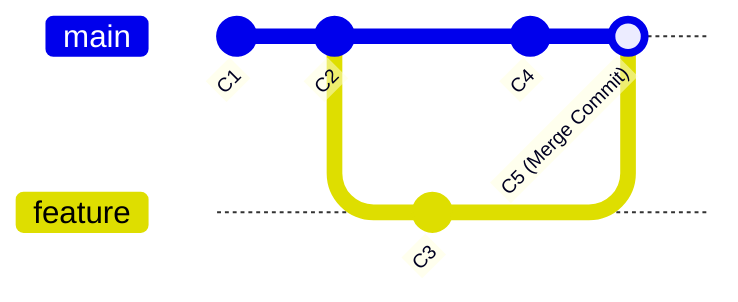
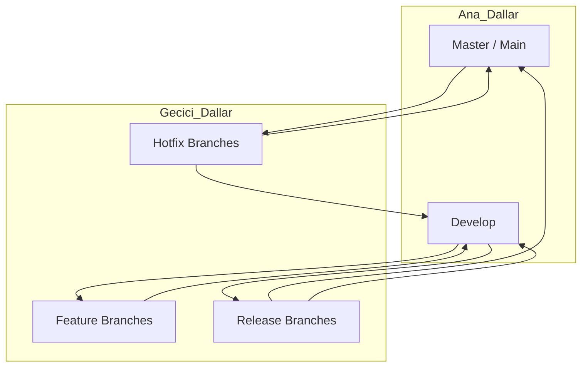

# 4. Branching ve Merging Stratejileri

Git'i diğer versiyon kontrol sistemlerinden ayıran en büyük özellik, dallanma (branching) mekanizmasının inanılmaz derecede hızlı ve hafif olmasıdır. Bu bölümde, aynı kod tabanı üzerinde nasıl paralel evrenler yaratacağımızı, bu evrenleri nasıl güvenle birleştireceğimizi ve kurumsal dünyada kullanılan standart iş akışlarını inceleyeceğiz.

## 4.1. Dallanma Felsefesi: Hafif İşaretçiler

Birçok eski sistemde dallanma, tüm dosyaların yeni bir klasöre kopyalanması anlamına gelirdi. Git'te ise bir dal, sadece belirli bir commit'e işaret eden 40 karakterlik bir SHA-1 hash değerini içeren küçük bir dosyadır.

### 4.1.1. Dalların Çalışma Mantığı
Dallanma yaptığınızda Git yeni bir dosya kopyalamaz. Sadece o anki commit'in üzerine yeni bir etiket yapıştırır. Bu yüzden dal oluşturmak milisaniyeler sürer. 

- **HEAD:** Git'in o anda hangi dal üzerinde çalıştığınızı bilmesini sağlayan özel bir işaretçidir.
- **main/master:** Projenin kararlı (stable) sürümünü temsil eden varsayılan dal.

<!-- CODE_META
id: git_branching_advanced_lab
chapter_id: chapter_04
language: shell
file: lab_branching_pro.sh
test: compile_run
-->

```shell
# 1. Yeni bir özellik dalı oluştur ve ona geç
git checkout -b feature/user-auth

# 2. Mevcut dalları ve hangisinde olduğumuzu gör
git branch -v

# 3. Dalların hangi commit'lere işaret ettiğini grafiksel gör
git log --oneline --graph --all

# 4. Bir dalı silmek (Eğer birleştirilmişse)
git branch -d feature/old-stuff

# 5. Bir dalı zorla silmek (Birleştirilmemiş olsa bile)
git branch -D feature/abandoned-experiment
```

## 4.2. Değişiklikleri Birleştirme (Merging)

Farklı bir dalda geliştirdiğiniz özelliği ana dala dahil etme sürecine **Merge** denir. İki ana türü vardır:

### 4.2.1. Fast-Forward Merge
Eğer `main` dalında siz ayrıldığınızdan beri yeni bir commit yapılmadıysa, Git sadece `main` etiketini sizin dalınızın ucuna taşır. Geçmiş dümdüz bir çizgi olarak kalır.

### 4.2.2. Three-Way Merge (Recursive)
Eğer her iki dalda da ilerleme varsa, Git iki dalın uçlarını ve ortak atalarını (common ancestor) kullanarak yeni bir "Merge Commit" oluşturur.



## 4.3. Kurumsal İş Akışları (Workflows)

Ekiplerin kaos yaşamadan çalışması için belirli kurallara ihtiyacı vardır.

### 4.3.1. GitHub Flow (Çevik ve Sürekli)
Sürekli canlıya çıkış yapan projeler için uygundur. Her şey `main` dalından ayrılır, PR açılır, test edilir ve tekrar `main`e birleştirilir.

### 4.3.2. GitFlow (Sürüm Odaklı)
Büyük ve periyodik sürüm çıkışları olan projeler için idealdir.
- **Master:** Sadece canlı sürümler.
- **Develop:** En son geliştirme hali.
- **Feature:** Yeni özellikler (Develop'tan ayrılır).
- **Release:** Sürüm hazırlık dalı.
- **Hotfix:** Canlıdaki acil hatalar (Master'dan ayrılır).



## 4.4. Çakışmaların (Merge Conflicts) Çözümü

Eğer iki kişi aynı dosyanın aynı satırını farklı şekilde değiştirirse Git karar veremez ve çakışma (conflict) ilan eder.

### 4.4.1. Çakışma Belirteçlerini Anlamak
```text
<<<<<<< HEAD
İletişim: ismail@example.com (Sizin dalınız)
=======
İletişim: destek@firma.com (Gelen dal)
>>>>>>> feature/contact-update
```

**Çözüm Adımları:**
1. Çakışan dosyayı bir metin editörü ile açın.
2. `<<<<`, `====`, `>>>>` işaretlerini ve istemediğiniz kodu silin.
3. Dosyayı kaydedin.
4. `git add <dosya>` ile çözüldüğünü işaretleyin.
5. `git commit` ile birleştirmeyi tamamlayın.

## 4.5. Uzak Dallarla (Remote Branches) Dans

Dallar yerel olabileceği gibi uzak sunucuda da olabilir.
- `git push origin feature/login`: Yerel dalı sunucuya gönderir.
- `git fetch origin`: Sunucudaki yeni dalları öğrenir.
- `git checkout --track origin/feature/api`: Sunucudaki bir dalı yerelinize takipçi olarak çeker.

## 4.6. Derinlemesine Bakış: "Detached HEAD" Nedir?

Eğer bir dal ismi yerine doğrudan bir commit hash değerine checkout yaparsanız (`git checkout a1b2c3d`), Git "Detached HEAD" durumuna geçer. Bu, "bir dal üzerinde değilsiniz, sadece geçmişteki bir fotoğrafa bakıyorsunuz" demektir. Burada yapacağınız commit'ler bir dala bağlı olmadığı için kolayca kaybolabilir. Kurtulmak için yeni bir dal açmanız gerekir: `git checkout -b temp-branch`.

## 4.7. Gerçek Dünya Senaryosu: "Acil Hotfix Gerekiyor!"

Senaryo: `feature/new-ui` dalında çalışıyorsunuz ve kodlarınız çok dağınık. Ancak canlıdaki (main) web sitesinde bir typo hatası olduğu bildirildi.
Çözüm:
1. Mevcut işlerini sakla: `git stash`
2. Ana dala geç: `git checkout main`
3. Hotfix dalı aç: `git checkout -b hotfix/typo`
4. Hatayı düzelt, commit et ve main'e birleştir: `git merge hotfix/typo`
5. Kendi işine dön: `git checkout feature/new-ui` ve `git stash pop`

## 4.8. Mülakat Soruları ve Cevapları

1. **Soru:** `git merge` ve `git rebase` arasındaki temel fark nedir?
   **Cevap:** `merge` geçmişi olduğu gibi korur ve yeni bir birleşme commit'i ekler. `rebase` ise bir daldaki commit'leri diğerinin ucuna taşıyarak doğrusal (linear) bir geçmiş yaratır. Rebase geçmişi yeniden yazar.

2. **Soru:** GitFlow'da `develop` dalı ne işe yarar?
   **Cevap:** `develop` dalı, bir sonraki sürüm için hazırlanan tüm özelliklerin toplandığı ana entegrasyon dalıdır. Kararlı (stable) değildir ancak üzerinde testler yapılır.

## 4.9. Bölüm Özeti ve Değerlendirme

Bu bölümde Git'in en güçlü yanı olan dallanmayı derinlemesine işledik.
- Dalların neden "hafif" olduğunu kavradık.
- Fast-forward ve Three-way merge farklarını gördük.
- GitFlow ve GitHub Flow gibi stratejileri karşılaştırdık.
- Çakışma yönetimini öğrendik.

**Değerlendirme Soruları:**
- Bir dalı silmek için neden `-d` yerine bazen `-D` gerekir?
- Merge conflict sırasında dosyada hangi işaretçiler belirir?
- `git checkout -b` komutunun yaptığı iki iş nedir?

Bir sonraki bölümde, bu dallanma ve birleştirme süreçlerini nasıl otomatiğe bağlayacağımızı göreceğiz: GitHub Actions!

---

### Profesyonel İpucu
Dallarınıza anlamlı isimler verin. `test1`, `deneme` yerine `feature/user-profile-api`, `bugfix/issue-404-header` gibi isimler hem sizin hem de ekibinizin işini kolaylaştırır.
