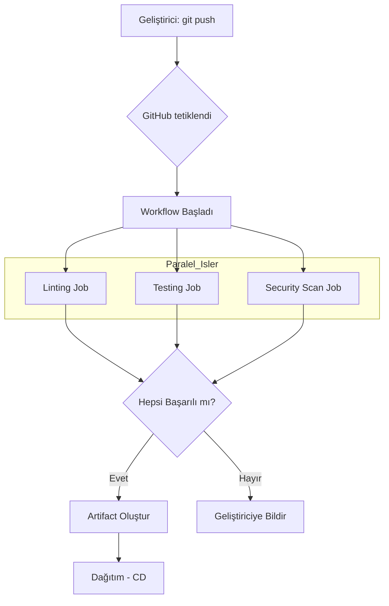

# 5. GitHub Actions ile CI/CD Temelleri

Yazılım geliştirme süreci sadece kod yazmaktan ibaret değildir; bu kodun test edilmesi, kalitesinin ölçülmesi ve güvenli bir şekilde sunucuya aktarılması gerekir. Eskiden bu işlemler manuel olarak veya karmaşık sunucu kurulumlarıyla (Jenkins gibi) yapılırdı. GitHub Actions, bu süreci doğrudan kod deponuzun içine, basit YAML dosyalarıyla entegre ederek devrim yaratmıştır.

## 5.1. CI/CD Nedir? (Sürekli Entegrasyon ve Dağıtım)

- **Continuous Integration (CI):** Geliştiricilerin kodlarını sık sık ana dala göndermesi ve her gönderimde kodun otomatik olarak derlenip test edilmesidir. Amaç, hataları "erken" yakalamaktır.
- **Continuous Deployment (CD):** Testlerden başarıyla geçen kodun, insan müdahalesi olmadan otomatik olarak canlı sisteme (production) aktarılmasıdır.

## 5.2. GitHub Actions Bileşenleri

GitHub Actions dünyasında dört ana kavram vardır:

1.  **Workflow (İş Akışı):** Projenizdeki otomasyonun en üst seviyesidir. Bir tetikleyici (push, pull request) ile başlar.
2.  **Job (İş):** Aynı "Runner" üzerinde çalışan adımlar dizisidir. Varsayılan olarak işler paralel çalışır.
3.  **Step (Adım):** Bir işin içindeki tek bir görevdir. Bir kabuk komutu (run) veya hazır bir aksiyon (uses) olabilir.
4.  **Runner (Çalıştırıcı):** İşlerin üzerinde çalıştığı sunucudur. GitHub size ücretsiz Ubuntu, Windows ve macOS makineler sağlar.

## 5.3. Uygulama: Profesyonel Bir CI Akışı Tasarlamak

Bir Python projesi için hem statik kod analizi (linting) yapan hem de testleri koşturan bir iş akışı oluşturalım.

<!-- CODE_META
id: pro_ci_workflow_detailed
chapter_id: chapter_05
language: yaml
file: .github/workflows/main_ci.yml
extract: false
-->

```yaml
name: Production Grade CI

on:
  push:
    branches: [ "main" ]
  pull_request:
    branches: [ "main" ]

jobs:
  lint-and-test:
    runs-on: ubuntu-latest
    
    strategy:
      matrix:
        python-version: ["3.9", "3.10", "3.11"]

    steps:
      - name: Kodu Çek (Checkout)
        uses: actions/checkout@v4

      - name: Python Kur (${{ matrix.python-version }})
        uses: actions/setup-python@v5
        with:
          python-version: ${{ matrix.python-version }}
          cache: 'pip' # Bağımlılıkları önbelleğe alarak hızı artırır

      - name: Bağımlılıkları Yükle
        run: |
          python -m pip install --upgrade pip
          pip install ruff pytest

      - name: Statik Analiz (Ruff)
        run: ruff check .

      - name: Testleri Çalıştır
        run: pytest tests/
```

## 5.4. Pipeline Görselleştirme

Bir kodun `git push` yapıldıktan sonra geçtiği aşamaları görelim:



## 5.5. Derinlemesine Bakış: Secrets ve Ortam Değişkenleri

Uygulamanızın bir veritabanına bağlanması veya bir API anahtarı kullanması gerekebilir. Bu hassas verileri asla YAML dosyasına yazmamalısınız.

1.  **GitHub Secrets:** GitHub deponuzun Ayarlar (Settings) > Secrets and variables kısmına giderek anahtar-değer çiftleri ekleyin.
2.  **Kullanım:** YAML içinde `${{ secrets.MY_API_KEY }}` şeklinde çağırın. Bu değerler loglarda otomatik olarak maskelenir (*** şeklinde görünür).

## 5.6. Matris (Matrix) Stratejisi ile Güçlü Testler

Yukarıdaki örnekte gördüğümüz `strategy: matrix` alanı, uygulamanızın farklı ortamlarda çalışabilirliğini garanti eder. Örneğin, bir kütüphane geliştiriyorsanız, onun hem Linux hem Windows üzerinde ve farklı Python sürümlerinde çalıştığından emin olmanız gerekir. GitHub bunu sizin için 6 farklı sanal makineyi aynı anda başlatarak yapar.

## 5.7. Koşullu Çalıştırma (Conditions)

Bazı adımların sadece belirli durumlarda çalışmasını isteyebilirsiniz:
- `if: github.event_name == 'push'`: Sadece push işlemlerinde çalıştır.
- `if: failure()`: Eğer önceki adımlardan biri başarısız olduysa (hata bildirimi göndermek için) çalıştır.

## 5.8. Gerçek Dünya Senaryosu: "Hatalı Kodun Canlıya Çıkmasını Engellemek"

Senaryo: Bir geliştirici yanlışlıkla `tests/` klasörünü etkileyen bir hata yaptı.
Süreç:
1. Geliştirici PR açar.
2. GitHub Actions otomatik tetiklenir.
3. `pytest` adımı başarısız olur (Exit Code 1).
4. GitHub, PR üzerindeki "Merge" butonunu kırmızıya boyar ve birleşmeyi engeller.
5. Ekip lideri hatayı görür ve düzeltme talep eder.
Sonuç: Hatalı kod asla `main` dalına ulaşmaz.

## 5.9. Mülakat Soruları ve Cevapları

1. **Soru:** GitHub Actions'ta "Self-hosted Runner" nedir?
   **Cevap:** GitHub'ın sağladığı bulut makineler yerine, kendi sunucunuzu (veya yerel bilgisayarınızı) bir iş parçacığı olarak GitHub'a bağlamanızdır. Özel donanım gereksinimleri veya yüksek güvenlikli iç ağ erişimleri için tercih edilir.

2. **Soru:** `actions/checkout@v4` ne işe yarar?
   **Cevap:** Sanal makine (Runner) başlatıldığında içi boştur. Bu aksiyon, sizin kod deponuzu (repository) o makinenin içine kopyalar ki sonraki adımlar kod üzerinde işlem yapabilsin.

## 5.10. Bölüm Özeti ve Değerlendirme

Bu bölümde, manuel süreçleri nasıl otomatize edeceğimizi öğrendik.
- CI/CD kavramlarını ve faydalarını inceledik.
- Workflow, Job ve Step hiyerarşisini kavradık.
- Secrets ile güvenli veri yönetimini gördük.
- Matris stratejisi ile çoklu ortam testlerini yaptık.

**Değerlendirme Soruları:**
- YAML dosyasında `on:` anahtarı neyi belirtir?
- Bir işin (Job) başarısız olması durumunda Slack bildirimi göndermek için hangi koşulu kullanırsınız?
- Secrets kullanırken neden `echo` ile yazdırmak güvenlidir? (İpucu: Maskeleme)

Bir sonraki bölümde, Git'in en "sihirli" ve bazen korkutucu olan ileri seviye komutlarını (Rebase, Cherry-pick) keşfedeceğiz!

---

### Sektörel Motto
"If it isn't automated, it's broken." (Eğer otomatik değilse, bozuktur.) Her manuel adım, bir insan hatası potansiyelidir.
