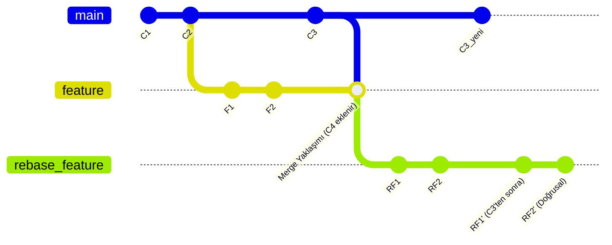

# 6. İleri Seviye Git Operasyonları

Git'te ustalaşmak, sadece komutları bilmek değil, projenin tarihçesini bir sanat eseri gibi işleyebilmektir. Bu bölümde, "Git Ninjaları"nın kullandığı ileri seviye teknikleri; tarihçeyi yeniden yazmayı (Rebase), nokta atışı commit taşımayı (Cherry-pick), hata avcılığını (Bisect) ve her şey bitti dediğinizde yardıma koşan Reflog'u öğreneceğiz.

## 6.1. Rebase: Temiz ve Doğrusal Geçmiş

Daha önceki bölümlerde `merge` ile dalları birleştirmeyi görmüştük. `merge` geçmişi olduğu gibi korur ama çok fazla "Merge branch..." commit'i ile geçmişi karmaşıklaştırabilir. **Rebase** ise bir daldaki tüm commit'leri "sanki en baştan diğer dalın ucunda yapılmış gibi" taşır.

### 6.1.1. Altın Kural: Kamusal Dallarda Rebase Yapmayın!
Rebase geçmişi yeniden yazar (commit hash değerleri değişir). Eğer bir dalı (`main` gibi) başkalarıyla paylaştıysanız ve o dalda rebase yapıp zorla (force) push ederseniz, ekip arkadaşlarınızın çalışma düzenini bozarsınız. **Kural:** Sadece kendi yerel özelliğinizde (feature branch) rebase yapın.

### 6.1.2. İnteraktif Rebase (Interactive Rebase)
Bu, Git'in en güçlü araçlarından biridir. `git rebase -i HEAD~n` komutu ile son `n` commit üzerinde şu işlemleri yapabilirsiniz:
- **pick:** Commit'i olduğu gibi tut.
- **reword:** Sadece commit mesajını değiştir.
- **edit:** Commit içeriğini değiştir.
- **squash:** Bu commit'i bir öncekiyle birleştir (Kendi aralarında 10 tane "fix", "yine fix" commit'ini tek bir anlamlı commit'e indirmek için idealdir).
- **drop:** Commit'i tamamen sil.

<!-- CODE_META
id: git_rebase_interactive_lab
chapter_id: chapter_06
language: shell
file: lab_rebase_pro.sh
test: compile_run
-->

```shell
# Son 5 commit'i temizleyelim
git rebase -i HEAD~5

# Açılan editörde ilk commit'i 'pick' bırakıp, 
# diğerlerini 'squash' (veya sadece 's') yaparak birleştirebilirsiniz.
```

## 6.2. Mermaid ile Rebase Görselleştirmesi

Rebase işleminin mantığını `merge` ile kıyaslayarak görelim:



## 6.3. Cherry-pick: İstediğini Al, Gerisini Bırak

Bazen başka bir daldaki 50 commit'ten sadece 1 tanesine (örneğin acil bir güvenlik yaması) ihtiyacınız olur. Tüm dalı birleştirmek yerine o commit'in hash değerini kullanarak onu mevcut dalınıza kopyalayabilirsiniz.

<!-- CODE_META
id: git_cherry_pick_lab
chapter_id: chapter_06
language: shell
file: lab_cherry_pick.sh
test: compile_run
-->

```shell
# Başka bir daldaki belirli bir commit'i getir
git cherry-pick a1b2c3d4
```

## 6.4. Git Bisect: Samanlıkta İğne Aramak

Projenizde bir hata var ama ne zaman oluştuğunu bilmiyorsunuz. 100 commit öncesinde her şey çalışıyordu, şimdi çalışmıyor. `git bisect` ikili arama (binary search) algoritmasını kullanarak hatalı commit'i saniyeler içinde bulmanızı sağlar.

1.  `git bisect start`: Süreci başlat.
2.  `git bisect bad`: Şu anki halin bozuk olduğunu işaretle.
3.  `git bisect good <sağlam_commit_hash>`: En son ne zaman çalıştığını söyle.
4.  Git sizi tam ortadaki commit'e götürür. Testinizi yapın ve `good` veya `bad` diyerek devam edin.
5.  Sonuçta Git size "Hata ilk bu commit'te başladı" diyecektir.

## 6.5. Git Reflog: Git'in Kara Kutusu

Diyelim ki yanlışlıkla çok önemli bir dalı sildiniz veya `git reset --hard` yaparak kodlarınızı yok ettiniz. Panik yok! Git, HEAD'in yaptığı her hareketi (dal değiştirme, commit, reset) 90 gün boyunca `reflog` içinde saklar.

<!-- CODE_META
id: git_reflog_pro_tips
chapter_id: chapter_06
language: shell
file: lab_reflog_pro.sh
test: compile_run
-->

```shell
# Tüm hareketleri listele
git reflog

# Çıktıda silinen commit'i bul (örn: HEAD@{5})
# O noktaya geri dön ve yeni bir dal açarak kurtar
git checkout -b recovered-branch HEAD@{5}
```

## 6.6. Git Hooks: Otomasyonu Yerelleştirin

Git Hooks, belirli olaylar gerçekleştiğinde (commit öncesi, push öncesi) otomatik çalışan betiklerdir. `.git/hooks` klasöründe bulunurlar.
- **pre-commit:** Kodun stili bozuksa commit yapmayı engeller.
- **pre-push:** Testler geçmiyorsa push işlemini durdurur.

## 6.7. Gerçek Dünya Senaryosu: "PR Öncesi Geçmişi Temizlemek"

Senaryo: `feature/login` dalında 3 gündür çalışıyorsunuz. Geçmişiniz şöyle görünüyor: "login taslağı", "hata düzeltme", "typo", "yine hata", "testler eklendi".
Çözüm:
1. `git rebase -i main`
2. İlk commit dışındakileri `squash` yap.
3. Mesajı "feat(auth): login sistemi ve testleri tamamlandı" olarak değiştir.
4. Şimdi tertemiz bir tek commit ile PR açmaya hazırsınız!

## 6.8. Mülakat Soruları ve Cevapları

1. **Soru:** Rebase yaparken çakışma (conflict) çıkarsa ne olur?
   **Cevap:** Rebase durur. Çakışmayı çözersiniz, `git add` yaparsınız ve `git merge` yerine `git rebase --continue` ile devam edersiniz. Git sıradaki commit'i uygulamaya çalışır.

2. **Soru:** `git reset` ile `git revert` arasındaki fark nedir?
   **Cevap:** `reset` commit'i tarihten siler (geçmişi değiştirir). `revert` ise hatayı düzeltmek için yeni bir "tersine çevirme" commit'i ekler (geçmişi korur). Kamusal dallarda her zaman `revert` kullanılmalıdır.

## 6.9. Bölüm Özeti ve Değerlendirme

Bu bölümde Git'in ileri seviye güçlerini keşfettik.
- Rebase ile temiz geçmiş oluşturmayı ve risklerini öğrendik.
- Cherry-pick ile seçici kod taşımayı gördük.
- Bisect ile hata ayıklama hızımızı 10 katına çıkardık.
- Reflog ile "silinemez" kodun gücünü fark ettik.

**Değerlendirme Soruları:**
- Neden `git push --force` komutundan kaçınmalıyız?
- İnteraktif rebase sırasında `fixup` ve `squash` arasındaki fark nedir?
- `git bisect` hangi algoritmayı kullanır?

Bir sonraki ve son bölümümüzde, en zorlu hata ayıklama senaryolarını ve "Disaster Recovery" (Felaket Kurtarma) yöntemlerini inceleyeceğiz!

---

### Profesyonel İpucu
Her zaman `git rebase` yapmadan önce mevcut dalınızın bir yedeğini alın (`git branch backup-feature`). Eğer rebase sırasında işler çok karışırsa, yedeğe dönmek hayat kurtarır.
