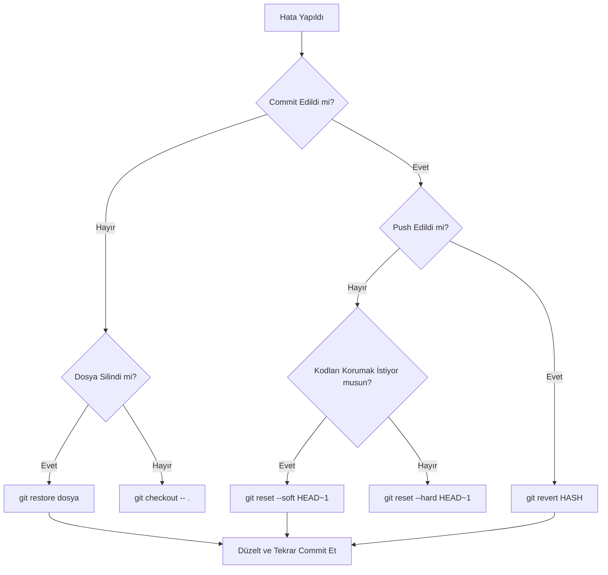

# 7. Hata Ayıklama ve Kurtarma Senaryoları

Yazılım geliştirme süreci her zaman planlandığı gibi gitmez. Bazen yanlış dalda çalışırız, bazen yanlışlıkla dosyalarımızı sileriz, bazen de hassas verileri (şifreler gibi) istemeden push ederiz. Panik, bir geliştiricinin en büyük düşmanıdır; Git ise en iyi dostu. Bu bölümde, Git'in sunduğu "Felaket Kurtarma" (Disaster Recovery) mekanizmalarını ve en karmaşık hatalardan bile nasıl tereyağından kıl çeker gibi çıkacağımızı öğreneceğiz.

## 7.1. Git Stash: Acil Durum Çekmecesi

Bir işin ortasındasınız, her yer darmadağın ve acil bir "Hotfix" geldi. Mevcut halinizi commit etmek istemiyorsunuz çünkü kodlar henüz çalışmıyor. İşte `git stash` burada devreye girer.

### 7.1.1. Gelişmiş Stash Yönetimi
- **git stash save "mesaj":** Değişiklikleri bir isimle saklar.
- **git stash list:** Saklanan tüm "çekmeceleri" listeler.
- **git stash apply stash@{2}:** Belirli bir yığını geri getirir ama listeden silmez.
- **git stash pop:** En son saklananı geri getirir ve listeden siler.
- **git stash branch <dal_adı>:** Stash'teki değişiklikleri alıp onlara özel yeni bir dal açar. (Çakışma riskini önlemek için harikadır).

<!-- CODE_META
id: git_stash_advanced_lab
chapter_id: chapter_07
language: shell
file: lab_stash_pro.sh
test: compile_run
-->

```shell
# 1. Tüm dosyaları (untracked dahil) sakla
git stash -u

# 2. Sadece belirli bir dosyadaki değişiklikleri sakla
git stash push path/to/file.py -m "Sadece bu dosyayı sakla"

# 3. Stash içeriğini geri getirmeden gör
git stash show -p stash@{0}
```

## 7.2. Geri Alma Sanatı: Reset ve Revert Farkı

Bir hatayı nasıl düzelteceğiniz, o hatanın nerede (yerel mi, sunucu mu) olduğuna bağlıdır.

### 7.2.1. Git Reset (Yerel Temizlik)
`git reset`, HEAD'i ve mevcut dalı geçmişteki bir commit'e taşır.
- **--soft:** Sadece commit'i iptal eder. Kodlar "Staged" (sahneye alınmış) olarak kalır.
- **--mixed (Varsayılan):** Commit ve Staging'i iptal eder. Kodlar "Modified" olarak durur.
- **--hard:** HER ŞEYİ SİLER. Kodlar o commit'teki haline döner. (Çok dikkatli olun!)

### 7.2.2. Git Revert (Kamusal Güvenlik)
Eğer hatalı kodu `push` yaptıysanız ve başkaları onu çektiyse, `reset` yapamazsınız. Bunun yerine `revert` kullanarak hatanın "tam tersini" yapan yeni bir commit eklersiniz. Bu sayede geçmiş bozulmaz.

## 7.3. Karar Verme Akışı (Recovery Decision Tree)

Hata yaptığınızda hangi yolu izlemeniz gerektiğini gösteren bir kılavuz:



## 7.4. Felaket Kurtarma: "Kayıp Commit'leri Bulmak"

Diyelim ki `git reset --hard` yaptınız ve 1 günlük emeğiniz uçtu gitti. Git gerçekten hiçbir şeyi silmez (en azından 30 gün boyunca).

1.  **Reflog ile Kurtarma:** `git reflog` komutunu çalıştırın. Silinen commit'in hash değerini bulun.
2.  **Kayıp Dalı Geri Getirme:** `git branch recovery-branch <hash>` komutu ile o commit'i yeni bir dala bağlayın. Kodlarınız geri geldi!

## 7.5. Derinlemesine Bakış: Hassas Veri Temizliği

Senaryo: Yanlışlıkla `config.json` dosyasında bir API anahtarı commit ettiniz ve push yaptınız. Sadece dosyayı silip yeni commit atmak yetmez; anahtar hala Git geçmişinde durur!

**Çözüm (BFG Repo-Cleaner veya git filter-repo):**
Bu araçlar tüm geçmişi tarayıp o dosyayı veya içindeki metni her yerden siler.
*Uyarı:* Bu işlemden sonra tüm ekip arkadaşlarınızın repoyu yeniden çekmesi gerekir çünkü geçmiş değişmiştir.

## 7.6. Yanlış Dala Commit Atma Senaryosu

Çok sık başımıza gelir: `main` dalındasınız ama aslında `feature/login` dalında olmanız gerekiyordu. 3 commit attınız bile.
Çözüm:
1. `git branch feature/login` (O anki halden yeni bir dal açar, commit'ler oraya da gider).
2. `git reset --hard HEAD~3` (Main dalındaki son 3 commit'i siler).
3. `git checkout feature/login` (Doğru dala geç ve çalışmaya devam et).

## 7.7. Mülakat Soruları ve Cevapları

1. **Soru:** `git checkout -- <file>` ile `git restore <file>` arasındaki fark nedir?
   **Cevap:** İşlevsel olarak aynıdır; her ikisi de dosyadaki commit edilmemiş değişiklikleri çöpe atıp son commit haline döndürür. `restore`, Git 2.23 ile gelen daha modern ve anlaşılır bir komuttur.

2. **Soru:** `.git` klasörüm bozuldu (corrupted), kodlarımı nasıl kurtarırım?
   **Cevap:** Eğer kodlarınızın bir kopyası GitHub'da varsa, mevcut klasörü silip tekrar `clone` yapmak en temiz yoldur. Eğer yerelde push edilmemiş kodlarınız varsa, başka bir klasöre clone yapıp, bozulan yerdeki `.git` klasörü hariç diğer dosyaları yeni klasöre taşıyarak farkları commit edebilirsiniz.

## 7.8. Kitap Özeti ve Kapanış

Bu kitap boyunca; yerel repo yönetiminden başladık, GitHub ile dünyayla işbirliği yaptık, karmaşık dallanma stratejileri kurduk, otomasyon (Actions) hatları inşa ettik ve ileri seviye operasyonlarla Git ustası olduk.

**Ana Prensiplerimiz:**
- Git'ten korkmayın, o her şeyi yedekler.
- Commit mesajlarınız bir hikaye anlatsın.
- Kamusal geçmişi asla (mecbur kalmadıkça) değiştirmeyin.
- Sürekli öğrenin ve yeni özellikleri (sparse-checkout, worktree vb.) takip edin.

Yolculuğunuzda başarılar dileriz. Artık kodlarınız her zamankinden daha güvende!

---

### Sektörel Motto
"Git is like a parachute: You don't need it until you do, and then you need it to work perfectly." (Git bir paraşüt gibidir: İhtiyacınız olana kadar fark etmezsiniz, ama ihtiyacınız olduğunda mükemmel çalışması gerekir.)
