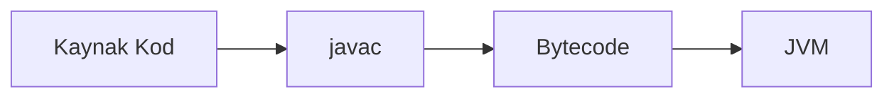

# Java’ya Kısa Giriş

## Bölümün yol haritası

Bu demo bölüm, Java kaynak kodunun çalıştırılabilir programa dönüşme akışını kısa biçimde gösterir.

<!-- DIAGRAM_META
id: java_intro_diagram01
chapter_id: java_intro
type: mermaid
title_key: "java_execution_flow"
auto_path: "assets/auto/diagrams/java_intro_diagram01.png"
manual_path: "assets/manual/diagrams/java_intro_diagram01.png"
final_path: "assets/final/diagrams/java_intro_diagram01.png"
manual_override: true
-->



## Kod örneği

<!-- CODE_META
id: java_intro_code01
chapter_id: java_intro
language: java
kind: example
title_key: "hello_java"
file: "HelloJava.java"
extract: true
test: compile_run_assert
github: true
qr: dual
expected_stdout_contains:
  - "Merhaba Java"
timeout_sec: 5
-->

```java
// File: HelloJava.java
public class HelloJava {
    public static void main(String[] args) {
        System.out.println("Merhaba Java");
    }
}
```

## Bölüm özeti

Java programı kaynak koddan bytecode’a, oradan JVM üzerinde çalışan programa dönüşür.


## Terim sözlüğü

| Terim | Açıklama |
|---|---|
| Java | Platform bağımsız çalışabilen genel amaçlı programlama dili. |
| Bytecode | Java kaynak kodunun derleme sonrasında JVM tarafından çalıştırılan ara biçimi. |
| JVM | Java bytecode'unu çalıştıran sanal makine. |
| javac | Java kaynak kodunu bytecode'a dönüştüren derleyici aracı. |
