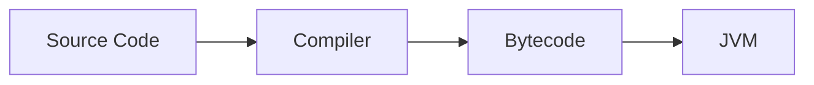

# Numbering Test Document

<!--
Purpose:
- This file tests whether build-time numbering can be applied without manual heading numbers.
- Headings below intentionally do NOT contain "Chapter 1", "1.1", "Figure 1.1", etc.
-->

# Java Intro

## Chapter roadmap

This heading must be numbered at build time, not in source Markdown.

<!-- DIAGRAM_META
id: java_intro_diagram01
chapter_id: java_intro
type: mermaid
title_key: "java_execution_flow"
auto_path: "assets/auto/diagrams/java_intro_diagram01.png"
manual_path: "assets/manual/diagrams/java_intro_diagram01.png"
final_path: "assets/final/diagrams/java_intro_diagram01.png"
manual_override: true
-->



## Code example

<!-- CODE_META
id: java_intro_code01
chapter_id: java_intro
language: java
kind: example
title_key: "hello_java"
file: "HelloJava.java"
extract: true
test: compile
github: true
qr: dual
-->

```java
// File: HelloJava.java
public class HelloJava {
    public static void main(String[] args) {
        System.out.println("Hello Java");
    }
}
```

## Table example

| Concept | Meaning |
|---|---|
| JVM | Runs bytecode |
| JDK | Provides development tools |
