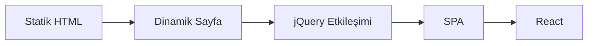
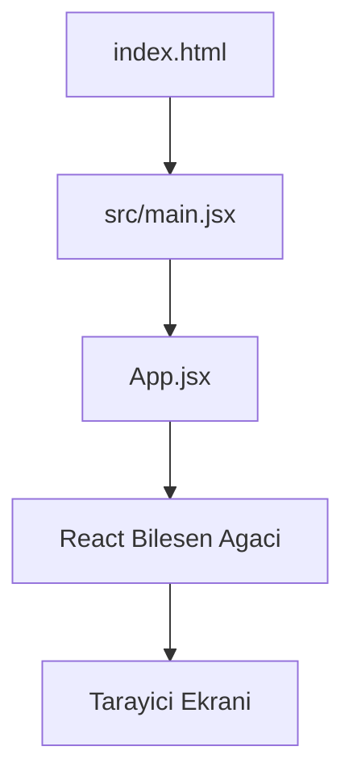
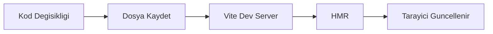
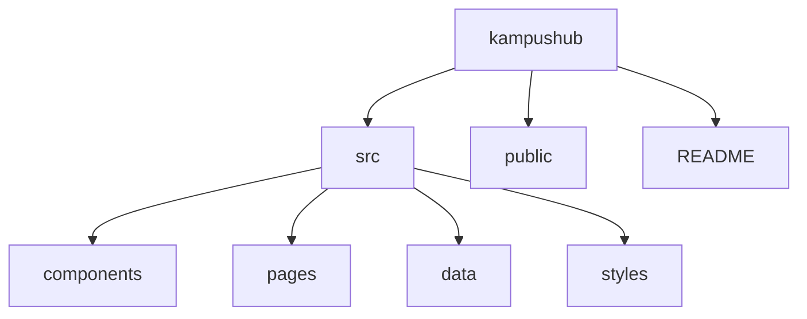

# React ile Web Uygulama Geliştirme — Bölüm 1 Üretim Girdisi

**Dosya yolu:** `workspace/react/prompts/chapter_inputs/chapter_01_input.md`  
**Bölüm:** 1  
**Bölüm başlığı:** Modern Web’e Giriş ve Geliştirme Ortamı  
**Kitap:** React ile Web Uygulama Geliştirme  
**Yazar:** Prof. Dr. İsmail KIRBAŞ  
**Sürüm:** v1.0  
**Dil:** Türkçe  
**Çıktı türü:** Bölüm outline üretim girdisi ve tam metin üretim yönlendirmesi  
**Ana proje:** KampüsHub  
**Varsayılan araç zinciri:** React 19 uyumlu modern React yaklaşımı, Node.js 22 LTS veya Node.js 24 LTS, npm, Vite güncel kararlı sürüm

---

## 1. Bu dosyanın amacı

Bu dosya, `Bölüm 1: Modern Web’e Giriş ve Geliştirme Ortamı` için üretim modeline verilecek ayrıntılı bölüm girdisidir. Model bu girdiyi kullanarak önce ayrıntılı bir **outline** üretmelidir. Kullanıcı açık onay vermeden tam bölüm metnine geçilmemelidir.

Bu bölümde amaç, React’e hiç başlamamış ancak temel HTML/CSS bilgisine sahip öğrenciyi modern web uygulamalarının mantığı, React’in rolü, yerel geliştirme ortamı, Vite tabanlı proje oluşturma ve KampüsHub projesinin ilk iskeletiyle tanıştırmaktır.

> **Üretim kuralı:** Bu girdi dosyası tam bölüm metni değildir. Önce outline hazırlanmalı, outline kontrol promptuna göre denetlenmeli, ardından kullanıcı onayıyla tam metin üretilmelidir.

---

## 2. Bölüm kimliği

| Alan | Değer |
|---|---|
| Bölüm ID | `chapter_01` |
| Bölüm no | 1 |
| Bölüm başlığı | Modern Web’e Giriş ve Geliştirme Ortamı |
| Kitap içindeki kısım | Kısım 0 — Temeller: JavaScript ve Modern Web |
| Hafta | 1 |
| Tahmini kapsam | 30–35 sayfa |
| Ana proje adımı | KampüsHub boş Vite React proje iskeleti |
| Ana pedagojik rol | Öğrenciyi React ekosistemine, araç zincirine ve proje çalışma düzenine hazırlamak |
| Önceki bölüm | Yok; kitap başlangıcı |
| Sonraki bölüm | Bölüm 2 — JavaScript ES6+ — React için Zorunlu Kavramlar |

---

## 3. Bölüm amacı

Bu bölüm, öğrencinin modern web uygulamalarının neden klasik statik sayfalardan farklı olduğunu kavramasını, React’in bileşen tabanlı yaklaşımını üst düzeyde tanımasını, Node.js/npm/Vite araç zincirini kurup doğrulamasını ve KampüsHub adlı dönem projesi için çalışır bir başlangıç iskeleti oluşturmasını amaçlar.

Bölüm sonunda öğrenci yalnızca kurulum yapmış olmayacak; aynı zamanda proje klasörlerini okuyabilecek, geliştirme sunucusunu başlatabilecek, HMR davranışını gözlemleyebilecek, tarayıcı geliştirici araçlarını açabilecek ve temel proje teslim standartlarını anlayacaktır.

---

## 4. Kitap içindeki konumu ve pedagojik rolü

Bölüm 1, kitabın giriş kapısıdır. Bu bölümde React’in ayrıntılı sözdizimi, props, state, hooks veya router konularına girilmez. Bunun yerine öğrenciye “React projesi hangi araçlarla geliştirilir, dosyalar nerede durur, tarayıcıda sonuç nasıl görülür, terminal komutları nasıl doğrulanır?” sorularının pratik yanıtları verilir.

Bu bölüm, Bölüm 2’deki modern JavaScript kavramlarına zemin hazırlar. Öğrenci Bölüm 2’ye geçmeden önce `node --version`, `npm --version`, `npm create vite@latest`, `npm install`, `npm run dev` ve `npm run build` komutlarının ne işe yaradığını görmüş olmalıdır.

KampüsHub açısından bu bölüm, proje klasörünün ve README dosyasının ilk kez oluşturulduğu adımdır. Sonraki bölümlerde bu iskelet üzerine mock veri, bileşenler, props, state, router, form, API ve test katmanları eklenecektir.

---

## 5. Hedef kitle ve başlangıç varsayımları

Bu bölüm aşağıdaki okuyucu profiline göre yazılmalıdır:

- HTML ve CSS bilen ancak React’e yeni başlayan lisans öğrencisi.
- Terminal/komut satırı deneyimi sınırlı olabilir.
- Node.js, npm, Vite, JSX ve bileşen kavramlarını daha önce kullanmamış olabilir.
- Dosya/klasör mantığını temel düzeyde bilir.
- Tarayıcıda bir web sayfasının görüntülendiğini bilir; ancak modern build araçlarının çalışma mantığını bilmez.

Bu bölümde kullanılacak persona örnekleri:

- **Elif:** React’e ilk kez başlayan Bilgisayar Mühendisliği 2. sınıf öğrencisi.
- **Yasemin:** Front-end odaklı, VS Code eklentileri ve proje düzeniyle ilgilenen öğrenci.
- **Ahmet:** Back-end geçmişinden gelen, npm ve istemci taraflı geliştirme akışını anlamaya çalışan öğrenci.
- **Bahar:** Lisansüstü araştırma projesi için sürdürülebilir bir arayüz iskeleti kurmak isteyen öğrenci.

---

## 6. Motivasyon sorusu

Bölümün açılışında şu motivasyon sorusu kullanılmalıdır:

> “Bir web sayfası yalnızca HTML ve CSS ile görüntülenebiliyorsa, neden React, Node.js, npm ve Vite gibi ek araçlara ihtiyaç duyarız?”

Bu soru üzerinden statik sayfa, dinamik arayüz, bileşen tabanlı geliştirme, SPA yaklaşımı ve geliştirme ortamı ihtiyacı öğrenci düzeyinde açıklanmalıdır.

---

## 7. Öğrenme çıktıları

Bu bölümün sonunda öğrenci:

1. Statik web sayfası, dinamik web uygulaması ve SPA yaklaşımı arasındaki farkı açıklayabilir.
2. React’in bileşen tabanlı mimari fikrini başlangıç düzeyinde tanımlayabilir.
3. Virtual DOM kavramını ayrıntıya girmeden kavramsal düzeyde açıklayabilir.
4. Node.js, npm ve Vite araçlarının React geliştirme sürecindeki rollerini ayırt edebilir.
5. Yerel bilgisayarda Node.js ve npm sürümlerini terminalden doğrulayabilir.
6. `npm create vite@latest` komutuyla React şablonlu yeni bir proje oluşturabilir.
7. `npm install`, `npm run dev` ve `npm run build` komutlarının amaçlarını karşılaştırabilir.
8. Vite ile oluşturulan React projesinin `src`, `public`, `index.html`, `main.jsx`, `App.jsx` ve `package.json` dosyalarının rollerini açıklayabilir.
9. Tarayıcı geliştirici araçlarını ve React DevTools’u başlangıç düzeyinde kullanabilir.
10. KampüsHub için başlangıç klasör yapısını ve README dosyasını hazırlayabilir.
11. HMR davranışını gözlemleyebilir ve basit bir dosya değişikliğinin tarayıcıya nasıl yansıdığını açıklayabilir.
12. Sık görülen kurulum ve komut çalıştırma hatalarını temel belirtilerden hareketle hata ayıklayabilir.

---

## 8. Zorunlu kavramlar

Tam metin üretiminde aşağıdaki kavramlar mutlaka yer almalıdır:

1. Web’in evrimi: statik sayfa, dinamik sayfa, jQuery dönemi, SPA yaklaşımı.
2. İstemci taraflı uygulama fikri.
3. React’in temel amacı ve bileşen tabanlı mimari.
4. Bileşen ağacı kavramı.
5. Virtual DOM kavramı: yalnızca kavramsal düzey.
6. React ekosistemi genel haritası: React, Vite, Router, state yönetimi, API, test, dağıtım.
7. Node.js’in React geliştirme sürecindeki rolü.
8. npm’in paket yöneticisi ve script çalıştırıcı olarak rolü.
9. npm / yarn / pnpm kısa karşılaştırması; ana akışta npm kullanılmalıdır.
10. VS Code ve önerilen eklentiler: ESLint, Prettier, ES7+ React snippets, Error Lens isteğe bağlı not.
11. Tarayıcı geliştirici araçları: Elements, Console, Network panellerine kısa giriş.
12. React DevTools’un kurulumu ve Components sekmesinin amacı.
13. Vite ile proje oluşturma.
14. Vite geliştirme sunucusu ve HMR.
15. Vite proje klasör yapısı.
16. `package.json` ve `scripts` alanı.
17. `src/main.jsx`, `src/App.jsx`, `index.html` dosyalarının başlangıç rolleri.
18. KampüsHub proje iskeleti.
19. README dosyasının proje teslimindeki rolü.
20. GitHub/code pages/QR entegrasyonuna hazırlık: yalnızca dosya düzeni ve kod çıkarma disiplini bağlamında.
21. Screenshot işaretleme standardı.
22. CODE_META HTML yorum bloğu standardı.
23. UTF-8 farkındalığı: metinlerde `KampüsHub`, dosya/klasör/identifier adlarında ASCII `kampushub` kullanılmalıdır.

---

## 9. Kapsam dışı bırakılacak konular

Bu bölümde aşağıdaki konular ana akışa alınmamalıdır:

- JSX’in ayrıntılı kuralları.
- Props, state, event yönetimi ve hooks.
- React Router kullanımı.
- Redux Toolkit, Zustand veya TanStack Query.
- React Hook Form veya form doğrulama.
- REST API entegrasyonu.
- Test yazımı ayrıntıları; yalnızca manuel doğrulama ve test hattı farkındalığı verilebilir.
- TypeScript ile proje oluşturma.
- Class component ile React anlatımı.
- Next.js, SSR, SSG, ISR, React Server Components ve Server Actions.
- Backend geliştirme, veritabanı, authentication server kodu.
- Docker, Kubernetes, CI/CD ayrıntıları.
- İleri performans optimizasyonu ve React Compiler ayrıntıları.

Bu konular yalnızca “ileride öğreneceğiz” veya “bu kitabın sonraki bölümlerinde ele alınacak” biçiminde kısa yönlendirme olarak anılabilir.

---

## 10. Zorunlu kod ve komut örnekleri

Bölüm 1 giriş bölümü olduğu için kod örnekleri kurulum, proje iskeleti, basit JavaScript doğrulaması ve Vite dosya yapısını tanıtmaya odaklanmalıdır. Tam bölüm metninde en az 4 temel kod/komut örneği, 1 hatalı+düzeltilmiş örnek, 1 mini uygulama ve 1 KampüsHub proje adımı bulunmalıdır. Hedef, mümkünse 8–10 küçük örnek vermektir.

### 10.1 Kod/komut örneği planı

| Kod ID | Başlık | Dosya / bağlam | Dil etiketi | Test türü | Amaç |
|---|---|---|---|---|---|
| `react_ch01_code01` | İlk JavaScript selamlama testi | `kampushub_selamlama.js` | `javascript` | `compile_run_assert` | BookFactory JavaScript test hattını ve UTF-8 çıktıyı doğrulamak |
| `react_ch01_cmd01` | Node.js ve npm sürüm kontrolü | terminal | `bash` | manuel | Geliştirme ortamının hazır olduğunu doğrulamak |
| `react_ch01_cmd02` | Vite React projesi oluşturma | terminal | `bash` | manuel | `kampushub` projesini oluşturmak |
| `react_ch01_code02` | `package.json` script alanını okuma | `package.json` | `json` | manuel | `dev`, `build`, `preview` komutlarının yerini göstermek |
| `react_ch01_code03` | React giriş noktası | `src/main.jsx` | `jsx` | manuel | `createRoot` ve `App` ilişkisinin başlangıç düzeyinde görülmesi |
| `react_ch01_code04` | İlk App bileşeni | `src/App.jsx` | `jsx` | manuel | Tarayıcıda görünen ilk KampüsHub metnini değiştirmek |
| `react_ch01_code05` | Proje bilgisi yardımcı dosyası | `src/data/projeBilgisi.js` | `javascript` | `compile_run_assert` | Basit JS modül mantığına hazırlık yapmak |
| `react_ch01_code06` | Basit stil dosyası | `src/styles/global.css` | `css` | manuel | Görsel iskelet için minimum CSS göstermek |
| `react_ch01_bug01` | Hatalı klasörde komut çalıştırma | terminal | `text` / `bash` | manuel | `npm run dev` komutunun doğru klasörde çalıştırılması gerektiğini göstermek |
| `react_ch01_bug02` | Hatalı import/dosya adı | `src/main.jsx` | `jsx` | manuel | Dosya adlarında büyük/küçük harf ve yol tutarlılığını göstermek |

### 10.2 CODE_META standardı

Test edilebilir kod bloklarında `CODE_META`, kod bloğunun içine değil, kod bloğundan hemen önce HTML yorum bloğu olarak verilmelidir.

Örnek standart:

````markdown
<!-- CODE_META
id: react_ch01_code01
chapter_id: chapter_01
language: javascript
kind: example
title_key: kampushub_selamlama
file: kampushub_selamlama.js
extract: true
test: compile_run_assert
github: true
qr: dual
expected_stdout_contains:
  - "Merhaba KampüsHub"
timeout_sec: 5
-->

```javascript
function selamla(projeAdi) {
  return `Merhaba ${projeAdi}`;
}

console.log(selamla("KampüsHub"));
```
````

**UTF-8 notu:** Kitap metninde proje adı `KampüsHub` olarak yazılmalıdır. Kod dosyası, klasör, identifier ve slug adlarında Türkçe karakter kullanılmamalı; `kampushub`, `projeAdi`, `KampusBaslik` gibi ASCII adlandırmalar tercih edilmelidir. Otomatik test ortamında UTF-8 stdout/stderr düzeltmesi uygulanmamışsa geçici uyumluluk için beklenen çıktı `Merhaba KampusHub` yapılabilir; ancak nihai hedef Türkçe karakterlerin doğru korunmasıdır.

### 10.3 Kod sonrası açıklama zorunluluğu

Her önemli kod örneğinden sonra şu açıklamalar bulunmalıdır:

- **Kodun amacı**
- **Kritik satırlar**
- **Beklenen terminal veya tarayıcı davranışı**
- **Dikkat noktası**
- **Küçük değişiklik önerisi**

---

## 11. KampüsHub proje adımı

Bu bölümde KampüsHub için yalnızca boş ve çalışır proje iskeleti oluşturulmalıdır. Uygulama işlevleri sonraki bölümlere bırakılmalıdır.

### 11.1 Oluşturulacak proje

```bash
npm create vite@latest kampushub -- --template react
cd kampushub
npm install
npm run dev
```

### 11.2 Hedef klasör yapısı

```text
kampushub/
├── public/
├── src/
│   ├── assets/
│   ├── components/
│   ├── data/
│   ├── pages/
│   ├── styles/
│   │   └── global.css
│   ├── App.jsx
│   └── main.jsx
├── index.html
├── package.json
└── README.md
```

### 11.3 README içeriği

README dosyasında en az şu başlıklar bulunmalıdır:

1. Proje adı: KampüsHub.
2. Projenin kısa amacı.
3. Kullanılan araçlar: React, Vite, Node.js, npm.
4. Kurulum adımları.
5. Geliştirme sunucusunu başlatma komutu.
6. Üretim derlemesi komutu.
7. Bölüm 1 çıktısı: boş proje iskeleti.
8. İleride eklenecek modüller: duyurular, etkinlikler, not paylaşımı, profil.

### 11.4 KampüsHub süreklilik tablosu

Tam bölüm metninde aşağıdaki tablo doldurulmalıdır:

| Bileşen | Açıklama |
|---|---|
| Eklenen özellik | Vite tabanlı boş KampüsHub React projesi |
| Değişen dosyalar | `package.json`, `src/main.jsx`, `src/App.jsx`, `src/styles/global.css`, `README.md` |
| Kullanılan kavram | Modern web araç zinciri, Vite geliştirme sunucusu, temel proje iskeleti |
| Test / kontrol | `npm run dev`, tarayıcıda başlangıç ekranı, `npm run build`, ekran görüntüleri |
| Sonraki bağlantı | Bölüm 2’de JavaScript ES6+ kavramlarıyla mock veri dosyaları hazırlanacak |

---

## 12. Screenshot planı

Bölüm 1 görsel ağırlıklı bir giriş bölümü olduğu için 3–4 programatik ekran çıktısı planlanmalıdır. Markdown içinde screenshot yer tutucuları şu standartla kullanılmalıdır:

```text
[SCREENSHOT:b01_01_vite_ilk_ekran]
```

### 12.1 Screenshot manifest taslağı

```yaml
screenshots:
  - id: b01_01_vite_ilk_ekran
    chapter: chapter_01
    figure: "Şekil 1.1"
    title: "Vite ile oluşturulan ilk React ekranı"
    route: "/__book__/chapter_01/vite-welcome"
    waitFor: "#root"
    actions: []
    output: "workspace/react/assets/screenshots/b01_01_vite_ilk_ekran.png"
    caption: "Vite React projesi başarıyla çalıştırıldığında tarayıcıda görülen başlangıç ekranı."
    markdownTarget: "[SCREENSHOT:b01_01_vite_ilk_ekran]"

  - id: b01_02_vs_code_klasor_yapisi
    chapter: chapter_01
    figure: "Şekil 1.2"
    title: "VS Code içinde KampüsHub klasör yapısı"
    route: "/__book__/chapter_01/folder-structure"
    waitFor: "[data-book-shot='folder-structure']"
    actions: []
    output: "workspace/react/assets/screenshots/b01_02_vs_code_klasor_yapisi.png"
    caption: "KampüsHub projesinde `src`, `components`, `pages`, `data` ve `styles` klasörlerinin başlangıç düzeni."
    markdownTarget: "[SCREENSHOT:b01_02_vs_code_klasor_yapisi]"

  - id: b01_03_devtools_console
    chapter: chapter_01
    figure: "Şekil 1.3"
    title: "Tarayıcı geliştirici araçlarında Console paneli"
    route: "/__book__/chapter_01/devtools-console"
    waitFor: "[data-book-shot='devtools-console']"
    actions:
      - "open_devtools_note"
    output: "workspace/react/assets/screenshots/b01_03_devtools_console.png"
    caption: "Console paneli, geliştirme sırasında hata mesajlarını ve `console.log` çıktılarını incelemek için kullanılır."
    markdownTarget: "[SCREENSHOT:b01_03_devtools_console]"

  - id: b01_04_kampushub_bos_iskelet
    chapter: chapter_01
    figure: "Şekil 1.4"
    title: "KampüsHub başlangıç ana ekranı"
    route: "/__book__/chapter_01/kampushub-shell"
    waitFor: "[data-book-shot='kampushub-shell']"
    actions: []
    output: "workspace/react/assets/screenshots/b01_04_kampushub_bos_iskelet.png"
    caption: "Bölüm 1 sonunda KampüsHub projesinin sade başlangıç arayüzü."
    markdownTarget: "[SCREENSHOT:b01_04_kampushub_bos_iskelet]"
```

### 12.2 Markdown içinde kullanılacak yer tutucular

Tam metinde aşağıdaki yer tutucular uygun noktalara yerleştirilmelidir:

```text
[SCREENSHOT:b01_01_vite_ilk_ekran]
[SCREENSHOT:b01_02_vs_code_klasor_yapisi]
[SCREENSHOT:b01_03_devtools_console]
[SCREENSHOT:b01_04_kampushub_bos_iskelet]
```

---

## 13. Mermaid / diyagram planı

Bölüm 1’de en az 3, mümkünse 4 sade Mermaid diyagramı planlanmalıdır. Diyagramlar 8–10 düğümü aşmamalı ve DOCX/PDF dönüşümünde PNG’ye çevrilebilecek kadar sade tutulmalıdır.

### 13.1 Diyagram 1 — Web’in evrimi

Amaç: Statik web sayfasından SPA yaklaşımına geçişi göstermek.



**Diyagram 1.1:** Web arayüzlerinin statik sayfalardan bileşen tabanlı SPA yaklaşımına evrimi.

### 13.2 Diyagram 2 — React uygulamasında temel akış

Amaç: `index.html`, `main.jsx`, `App.jsx` ve tarayıcı çıktısı ilişkisini göstermek.



**Diyagram 1.2:** Vite React projesinde başlangıç dosyalarının tarayıcı çıktısına dönüşme akışı.

### 13.3 Diyagram 3 — Vite geliştirme döngüsü

Amaç: Dosya kaydetme, HMR ve tarayıcı güncelleme ilişkisini göstermek.



**Diyagram 1.3:** Vite geliştirme sunucusu ve HMR ile hızlı geri bildirim döngüsü.

### 13.4 Diyagram 4 — KampüsHub başlangıç klasörleri

Amaç: Proje klasörlerinin sorumluluklarını özetlemek.



**Diyagram 1.4:** KampüsHub başlangıç klasör yapısı.

---

## 14. Hata ayıklama egzersizi planı

Bölüm 1’in hata ayıklama egzersizi kurulum ve komut çalıştırma odaklı olmalıdır. React state, hook veya router hataları bu bölümde kullanılmamalıdır.

### 14.1 Ana hata senaryosu

**Hata türü:** Yanlış klasörde `npm run dev` çalıştırma veya `npm install` adımını atlama.

Hatalı terminal örneği:

```text
npm ERR! Missing script: "dev"
```

Öğrenciye sorulacak sorular:

1. Bu hata hangi klasörde komut çalıştırıldığını gösteriyor olabilir?
2. `package.json` dosyasında `scripts` alanı nerede kontrol edilir?
3. `npm install` çalıştırılmadan `npm run dev` denenirse ne tür sorunlar yaşanabilir?
4. Doğru komut sırası nedir?

Düzeltilmiş komut akışı:

```bash
cd kampushub
npm install
npm run dev
```

Korunma kuralı:

> Terminalde bir npm script’i çalıştırmadan önce doğru proje klasöründe olduğunuzu ve o klasörde `package.json` dosyasının bulunduğunu kontrol edin.

### 14.2 Ek hata senaryoları

- Node.js sürümü Vite gereksinimini karşılamıyor.
- `npm create vite@latest` komutunda proje adı Türkçe karakter veya boşluk içeriyor.
- `src/App.jsx` dosyası kaydedilmediği için HMR sonucu görünmüyor.
- `App.jsx` / `app.jsx` büyük-küçük harf farkı nedeniyle import hatası alınıyor.
- Tarayıcıda doğru local URL açılmıyor.

---

## 15. Laboratuvar / proje görevi

**Görev başlığı:** KampüsHub Vite React Proje İskeleti

**Amaç:** Öğrencinin yerel geliştirme ortamında Vite ile React projesi oluşturması, başlangıç klasör yapısını düzenlemesi, çalışır ekranı doğrulaması ve README dosyası hazırlamasıdır.

### 15.1 Beklenen adımlar

1. `node --version` ve `npm --version` komutlarıyla ortamı doğrulayın.
2. Node.js sürümü uygun değilse Node.js 22 LTS veya 24 LTS kurulumunu tamamlayın.
3. `npm create vite@latest kampushub -- --template react` komutuyla projeyi oluşturun.
4. `cd kampushub` komutuyla proje klasörüne geçin.
5. `npm install` ile bağımlılıkları kurun.
6. `npm run dev` ile geliştirme sunucusunu başlatın.
7. Tarayıcıda Vite başlangıç ekranını açın.
8. `src/App.jsx` içinde başlangıç metnini KampüsHub’a uygun hâle getirin.
9. `src/components`, `src/pages`, `src/data`, `src/styles` klasörlerini oluşturun.
10. `README.md` dosyasını yazın.
11. En az üç ekran görüntüsü alın.
12. `npm run build` ile üretim derlemesini doğrulayın.

### 15.2 Teslim edilecekler

- Güncellenmiş `kampushub` proje klasörü.
- `README.md` dosyası.
- `npm run dev` çalışır ekran görüntüsü.
- VS Code klasör yapısı ekran görüntüsü.
- `npm run build` başarılı terminal çıktısı veya kısa doğrulama notu.
- Kısa öz değerlendirme: “Bu bölümde hangi komutları öğrendim?”

---

## 16. Değerlendirme rubriği

| Ölçüt | Puan | Açıklama |
|---|---:|---|
| Ortam doğrulama | 15 | `node --version`, `npm --version` ve uygun Node.js sürümünün doğrulanması |
| Vite projesi oluşturma | 20 | `kampushub` projesinin doğru şablonla oluşturulması ve bağımlılıkların kurulması |
| Geliştirme sunucusu | 15 | `npm run dev` ile projenin tarayıcıda çalıştırılması |
| Klasör yapısı | 15 | `components`, `pages`, `data`, `styles`, `assets` gibi başlangıç klasörlerinin düzenli oluşturulması |
| README kalitesi | 15 | Amaç, kurulum, çalıştırma ve sonraki modüllerin açık yazılması |
| Ekran görüntüsü ve kanıt | 10 | En az üç açıklayıcı ekran çıktısının teslim edilmesi |
| Hata ayıklama farkındalığı | 10 | Karşılaşılan hata veya kontrol adımlarının kısa notla açıklanması |
| **Toplam** | **100** |  |

---

## 17. Erişilebilirlik, kullanıcı deneyimi ve güvenlik notları

Bu bölümde erişilebilirlik konusu derinleştirilmemelidir; ancak başlangıç ekranında semantik HTML farkındalığı verilebilir.

- Başlangıç `App.jsx` örneğinde ana içerik için `main`, başlık için `h1`, açıklama için `p` kullanılmalıdır.
- Tıklanabilir öğe varsa gerçek `button` veya `a` kullanılmalıdır.
- Görsel kullanılırsa anlamlı `alt` metni verilmelidir.
- `.env` dosyalarının gizli bilgi saklama yeri olmadığı kısa güvenlik notu olarak anılabilir; ayrıntı API bölümüne bırakılmalıdır.
- `dangerouslySetInnerHTML` kullanılmamalıdır.
- Kullanıcı girdisi alınmadığı için XSS ayrıntısına girilmemelidir.

---

## 18. Test, doğrulama ve kalite kontrol

Bölüm 1’de kapsamlı test yazımı beklenmez. Buna rağmen öğrenci şu doğrulama adımlarını görmelidir:

1. `node --version` çıktısının uygun sürümü göstermesi.
2. `npm --version` çıktısının alınması.
3. `npm run dev` sonrası local URL’nin çalışması.
4. `src/App.jsx` değişikliğinin HMR ile tarayıcıya yansıması.
5. `npm run build` komutunun başarıyla tamamlanması.
6. BookFactory için en az bir basit JavaScript `CODE_META` bloğunun çıkarılıp test edilebilir olması.

Tam metinde “test edildi” ifadesi yalnızca gerçekten test hattına uygun kod örnekleri için kullanılmalıdır. Manuel kontrol gereken örnekler açıkça “manuel doğrulama” olarak belirtilmelidir.

---

## 19. Kaynak ve ileri okuma önerileri

Bölüm sonunda 2–4 kaynak verilmelidir. Önerilen kaynak kümesi:

1. **React Docs — Quick Start:** React bileşen fikrine ve modern başlangıç akışına giriş için.
2. **Vite Docs — Getting Started:** Vite proje oluşturma, geliştirme sunucusu ve build süreci için.
3. **Node.js Release Schedule:** Node.js LTS sürümlerini ve bakım takvimini anlamak için.
4. **MDN — Web platform basics:** HTML, CSS, JavaScript ve tarayıcı temellerini hatırlamak için.

Kaynak listesinde ham URL yığını verilmemeli; kaynak adı ve kullanım amacı açıklanmalıdır.

---

## 20. Tam metin üretimi için açık yönlendirme

Bu girdi dosyasını kullanan model aşağıdaki kurallara uymalıdır:

1. Önce ayrıntılı outline üret; kullanıcı açık onay vermeden tam metne geçme.
2. Outline, bölüm yapısı standardındaki ana bileşenleri içersin.
3. Outline’da her kod örneği için dosya yolu, dil etiketi, test/manuel kontrol türü ve amaç belirt.
4. Outline’da screenshot planı ve Mermaid diyagram planı görünür olsun.
5. Outline’da KampüsHub süreklilik tablosu planlansın.
6. Outline’da hata ayıklama egzersizi ve laboratuvar görevi bulunsun.
7. Tam metin aşamasında YAML front matter ile başla.
8. Tam metin başlığı yalnızca bir kez `# Bölüm 1: Modern Web’e Giriş ve Geliştirme Ortamı` biçiminde kullanılsın.
9. Başlıklar `## 1.1`, `## 1.2`, `## 1.3` biçiminde ardışık ilerlesin.
10. Kod blokları tablo, blockquote veya liste içine gömülmesin.
11. Hatalı kod örnekleri `// HATALI ÖRNEK`, düzeltilmiş örnekler `// DÜZELTİLMİŞ ÖRNEK` etiketiyle verilsin.
12. CODE_META blokları kod bloğunun içine değil, kod bloğundan önce HTML yorum bloğu olarak yazılsın.
13. Screenshot yer tutucuları `[SCREENSHOT:...]` standardıyla verilsin.
14. Mermaid diyagramları sade tutulup her diyagramın altında açıklama başlığı verilsin.
15. Bölüm sonunda şu 5 bileşen yer alsın: bölüm özeti ve terim sözlüğü, kavramsal sorular, programlama alıştırmaları, haftalık laboratuvar/proje görevi, ileri okuma ve bir sonraki bölüme köprü.
16. `BÖLÜM SONU` ifadesi dönüşüm hattı tarafından otomatik üretilecekse Markdown içinde tekrar edilmesin.
17. Class component, TypeScript, Next.js, SSR, backend, GraphQL ve React Native ana akışa alınmasın.
18. Bölüm 2’ye köprü şu fikri taşısın: “Artık proje ortamını kurduk; sonraki bölümde React kodunu yazabilmek için gerekli modern JavaScript kavramlarını öğreneceğiz.”

---

## 21. Beklenen outline çıktısı

Modelden beklenen ilk çıktı şu ana başlıklarla bir outline olmalıdır:

1. Bölüm amacı ve pedagojik rol
2. Bölümün kitap içindeki konumu
3. Öğrenme çıktıları
4. Ön bilgi ve başlangıç varsayımları
5. Ana alt başlık planı
6. Zorunlu kavram haritası
7. Kod/komut örnekleri planı
8. KampüsHub proje adımı
9. Screenshot planı
10. Mermaid/diyagram planı
11. Hata ayıklama egzersizi
12. Laboratuvar/proje görevi
13. Değerlendirme rubriği
14. Kapsam dışı konular
15. Bölüm sonu bileşenleri
16. Bir sonraki bölüme köprü
17. Tam metin üretim kalite kontrol listesi

---

## 22. Kısa kalite kontrol listesi

Outline veya tam metin tamamlandıktan sonra şu kontroller yapılmalıdır:

```text
[ ] Bölüm 1’in tüm zorunlu kavramları karşılandı.
[ ] Node.js 22/24 LTS ve güncel Vite vurgusu var.
[ ] `node --version`, `npm --version`, `npm create vite@latest`, `npm install`, `npm run dev`, `npm run build` komutları planlandı.
[ ] React DevTools ve tarayıcı geliştirici araçları yer aldı.
[ ] KampüsHub boş proje iskeleti ve README görevi tanımlandı.
[ ] En az 4 kod/komut örneği, 1 hata örneği, 1 mini uygulama, 1 proje adımı planlandı.
[ ] CODE_META standardı HTML yorum bloğu olarak verildi.
[ ] Screenshot manifest alanları eksiksiz tanımlandı.
[ ] Mermaid diyagramları sade ve PNG dönüşümüne uygun.
[ ] Kapsam dışı konular ana akışa alınmadı.
[ ] Bölüm sonu 5 bileşeni planlandı.
[ ] Bir sonraki bölüme köprü yazıldı.
```
